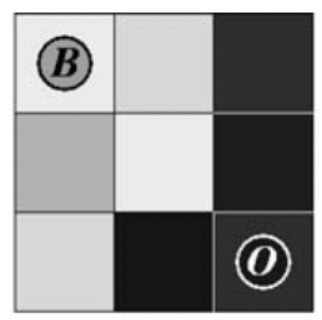
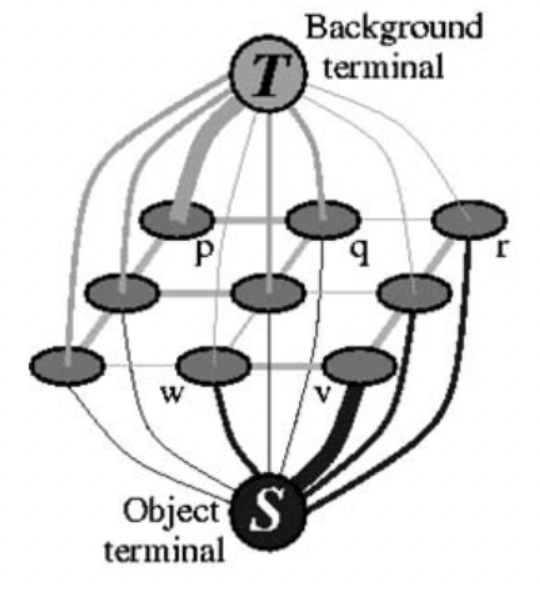
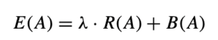
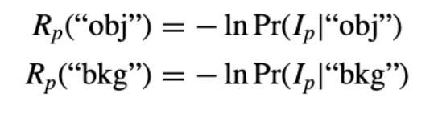
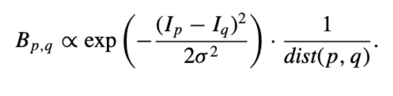
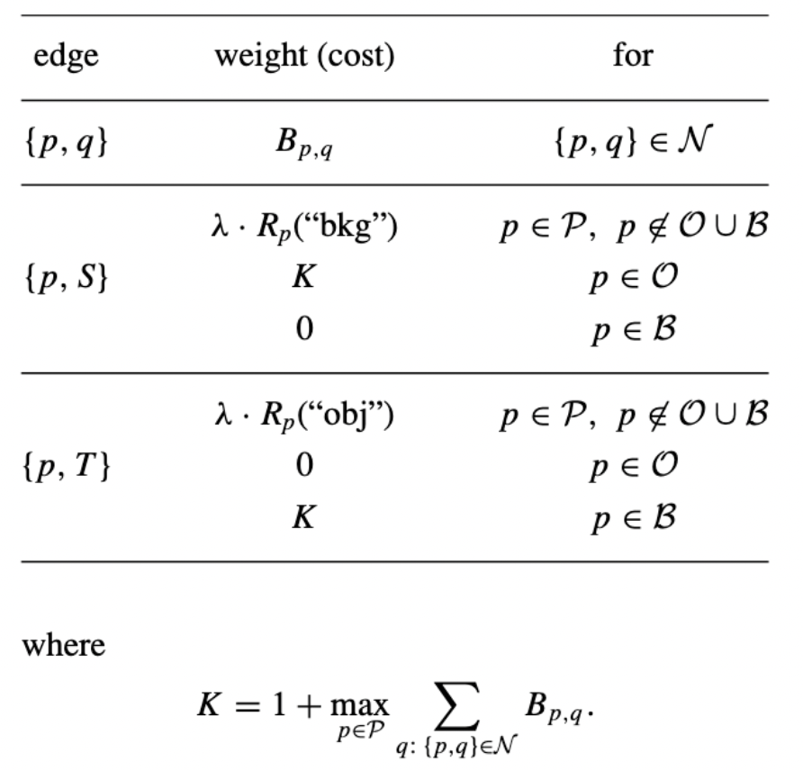
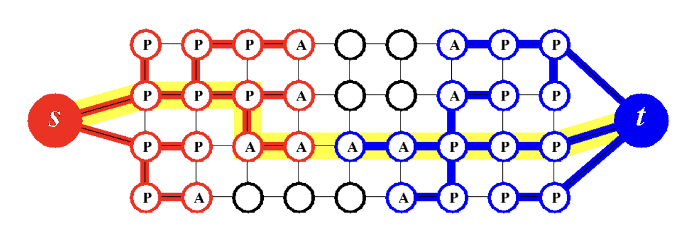
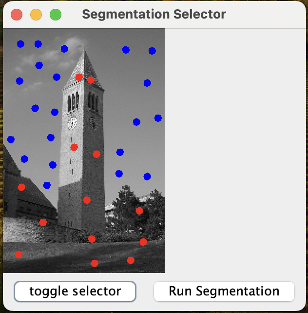
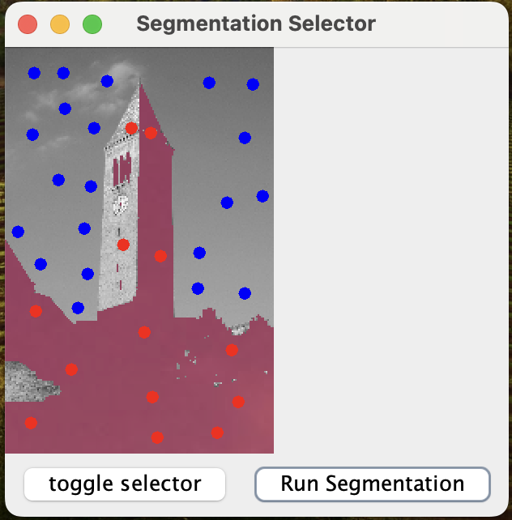
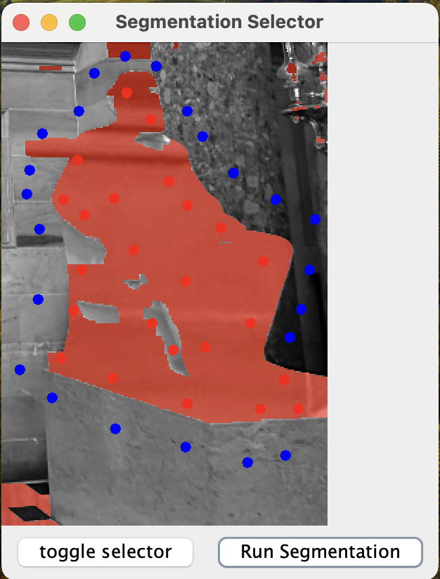

# Image Segmentation Demo

## Overview
Given an input image, we construct a network flow graph, we separate the pixels of the image into two groups, foreground and background
using optimization methods.

In combinatorics, max flow can be used to model a problem as vertices and find the maximum amount of flow that can be pushed from
a source node to a sink node. Conversely, a min cut can be solved from a max flow, where the minimum sum of capacities on these severed
connections is equivalent to the value of max flow.

## Ford Fulkerson
The problem can be modeled as a bipartite graph, where the left side of the graph consists of source node and edges that connect the 
source node to the other nodes, and the right side of the graph consists of more nodes connected to by edges from neighboring nodes and 
edges to the sink node. 

These edges have a value of flow and capacity, where both are non-negative and must be integers.
Aside from the capacity constraint, the inflow to a node is conserved for the outflow. 

Ford Fulkerson method keeps track of the flow and residual value on all edges throughout its iterations. To begin, it finds a augmenting path
from the source node to the sink node in the residual graph and find a bottleneck value (the smallest residual capacity along the augmenting path)
and increase flow in forward edges while decreasing flow in backward edges. Eventually, we will find a way to push the maximum amount of flow from the 
source node to sink node.

In the Edmonds-Karp implementation of this method, Breadth First Search is used to find the shortest augmenting path on each iteration and adjusting the flow of 
the edges until certain edges are saturated meaning there's no more augmenting path from source to sink. 

Once an edge is saturated, it will no longer appear as available in the residual graph. In the residual graph, nodes reachable by non-saturated edges /
edges that have nonzero residual capacity in the residual graph from the source node will be separated from nodes that can't be reached (including the sink node).

## Image Processing
When provided with an image to partition, the program first grayscales the image in order to reduce the 3-channel RGB space to a single-channel
intensity scale. This step retains the luminance information while discarding chrominance, which reduces computational complexity while increasing
gradient and structural clarity. 

Next, the image is resized with a factor in order to reduce computation time until further optimization on the algorithm is made.

We represent each pixel as nodes and store their intensity information. Next, the user selects a source and a sink node, which can be modeled
to our network flow graph problem. The source node can be the object or background, and the sink node is the opposite. We aim to separate the two
groups for image segmentation.

 

## Modeling to Network Flow
The objective function of this optimization can be provided by the energy function below. 

R(A) is our regional term which incentivizes the incorporation of certain pixels into either the cut or uncut sets based on the intensity distribution
in the user input. Lambda is a constant that weighs the relative importance of this term in the energy function.
The regional terms is calculated with histogram and likelihood functions based on user inputs.

The value is scaled up to be in the range of [1, 100]

B(A) is the boundary term, it ensures regional consistency and a smooth border when the image is segmented. The term places penalties on disjointing
neighboring pixels when partitioning. And it is calculated by the change in intensity divided by the camera noise. 
The exponent function ensures larger intensity change between neighboring pixels will provide a cheaper-costing edge to cut.
The term penalizes cutting between similar pixels, but it doesn't penalize not cutting in general.

We set the edge weight as follows:

Lastly, we can improve the solution and enable the intensity distribution by using a hard constraints. These are user inputs that provide 
topological context on the image and is done by hardcoding certain pixels into set O and B. Pixels in set O have an expensive edge to the source node,
making it impossible to cut, whereas pixels in set B have expensive edges to the sink node. These edges are labeled as K. 

## Fast Algorithm and Improvement

Edmonds-Karp algorithm is fairly slow as it relies on BFS each time to find a new augmenting path.

The algorithm developed by Yuri Boykov and Vladimir Kolmogorov also uses the Ford-Fulkerson method to find the max flow / min cut on a flow graph.
The algorithm grows and maintains "trees" from the terminals as it runs and finds augmenting paths at the intersections of those trees.
Empirically in vision problems, BK performs better than Edmonds-Karp - while previously images need to be downsized for the program to finish the 
computations, BK is able to find the graph cut for a larger image in multi-seconds runtime. 

The incorporation of this algorithm into the segmentation tool improves the performance, however processing time and correctness of the result can still
be fine-tuned.

When the augmenting path was found and the flow values are adjusted on the edges, saturated edges will cause a node to be "orphaned" and disconnected from its tree. 
A process is used to find another edge to connect the orphan back to its original tree. If no such parent is found, the orphan is put back to the set of free nodes, 
which is the initial set of nodes that are not associated with either tree. 
This stage of the algorithm can be time-consuming. Since part of the criteria for a valid parent is that it must be rooted at a terminal - this is due to the fact that
potential parents may be "orphaned" and not actually part of the tree - the algorithm back propagates from the potential parent node and determine that it's actually rooted at a tree.
This operation is costly and is performed each time an orphan seeks potential parents. 

The fine-tuning for optimized performance involves checking and marking nodes for being rooted at a terminal, and recording its distance from the given terminal to build
a shorter augmenting path each time.

Lastly, if the initial selection of seeds for hard constraints produce poor results where pixels intended as object is highlighted as the background or vice versa. 
The graph itself can be modified and additional seeds can be added by the user to manipulate the algorithm to labeling pixels as object or background pixels. A new complete
cut can be produced relatively quickly given the new solution is built on top of the original graph.

## Results

Simple example:

Other examples:

 

Larger Image

 

## Usage on Desktop

1. Git fetch
2. Build Maven project and install dependencies
3. Modify image to be processed and input an appropriate downsize factor
3. Run Main, the user entrypoint to the program
4. Click once to select object, second click to select background
5. Select as many obj pixels as deemed necessary for hard constraints, then click toggle selector to
    begin selection for bkg hard constraint pixels
6. Run segmentation and wait for algorithm to run